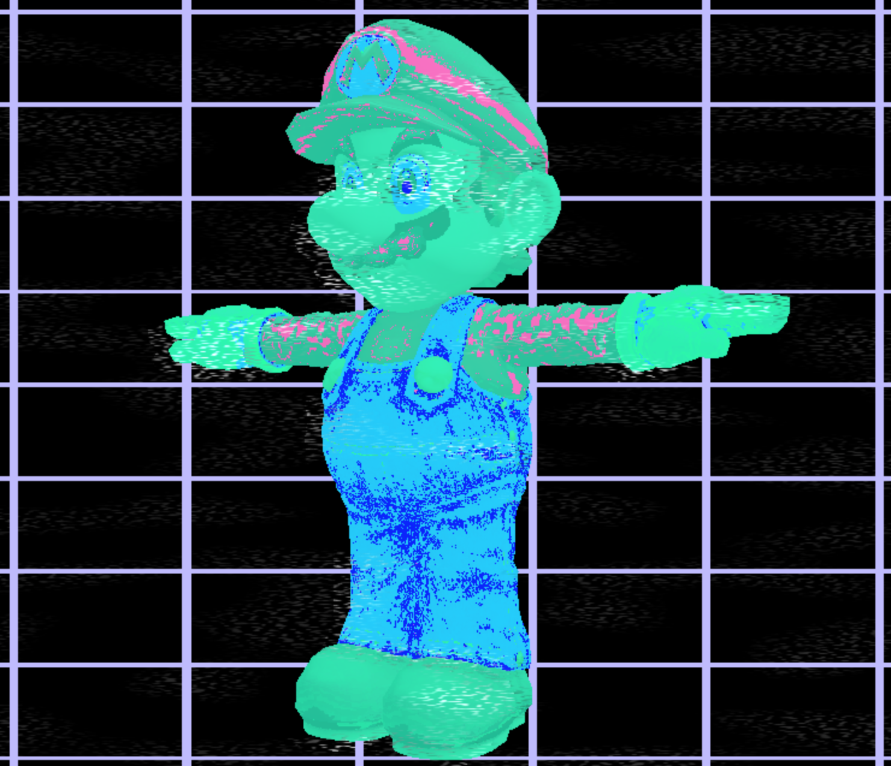
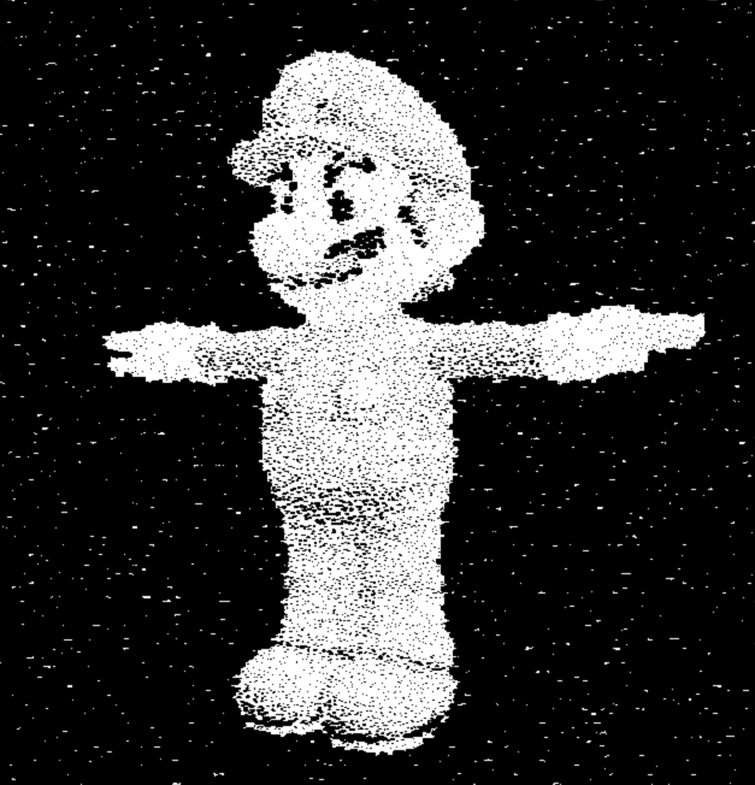
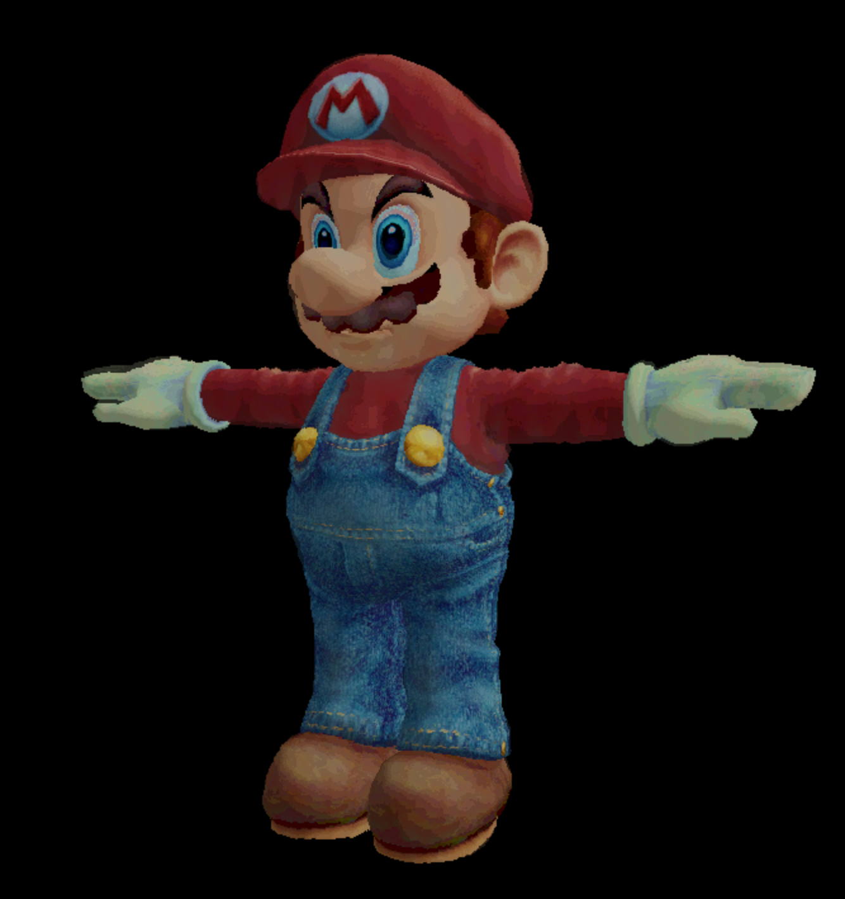
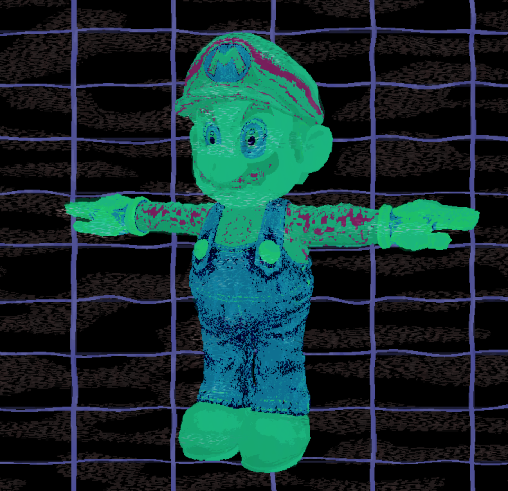
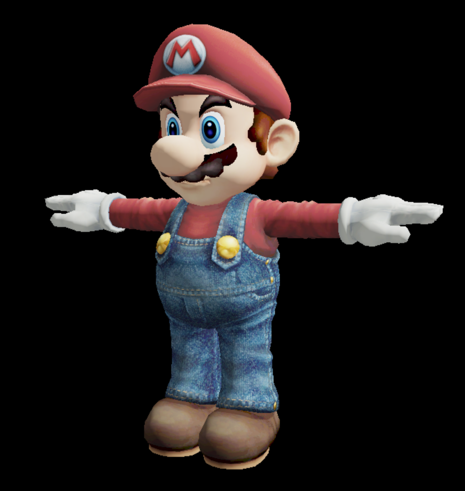
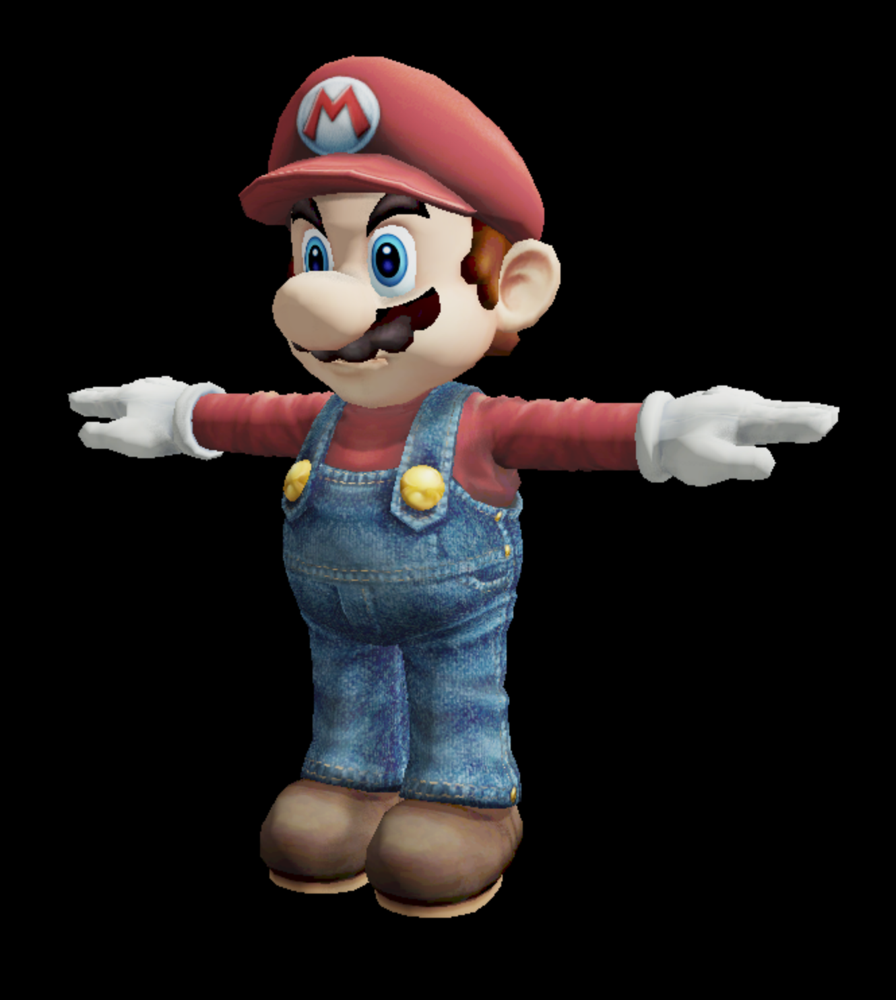

# Project 7: Deferred Renderer

Charles Wang\
PennKey: chawang

## Why Did I Do More Vaporwave?

[Live Demo](http://charlesliwang.com/homework-7-deferred-renderer-charlesliwang/)

## Ｐｒｏｊｅｃｔ　Ｏｖｅｒｖｉｅｗ　ａｎｄ　Ｉｍｐｌｅｍｅｎｔａｔｉｏｎａｌ　ｄｅｔａｉｌｓ　ぼ蒸閲内の

Post-processing effects can be toggled and stacked.

### Pointalism

Each fragment checks four neighboring grid cells (offset by some noise value) and checks to see if it is within a radius determined by the luminance at the grid point.\
The lower the luminance (darker), the larger the radius.\
If the fragment is within the radius, it is colored black, otherwise, white.\
Overall luminance before pointalism is raised such that the background will have some speckles too.

### Paint

Fragments are distorted by a 2D curlnoise.\
A vertically stretched simplex noise shifts some of the levels to create "brush-"like" separation.\
Luminance and hues are also assigned by a step function to limit the number of colors. \
This is kind of like a fake k-means where the target colors are not based on the original pallete

### Vaporwave

Not sure why I did this one to myself but it happened\
I mapped the colors to a vaporwave pallete and added some static-y effects.\
Combine this effect with the paint effect and you get a zombie-wave effect

### Screen Space Ambient Occlusion

This SSAO is fairly simple and is a little buggy but with the albedo, and lighting, it adds a nice touch.

 

## References
[Curl Noise](http://platforma-kooperativa.org/media/uploads/curl_noise_slides.pdf)\
[Curl Noise GLSL](https://github.com/cabbibo/glsl-curl-noise/blob/master/curl.glsl)\
[Simplex and Perlin](https://gist.github.com/patriciogonzalezvivo/670c22f3966e662d2f83)\
[SSAO Shadertoy]( https://www.shadertoy.com/view/4ltSz2)